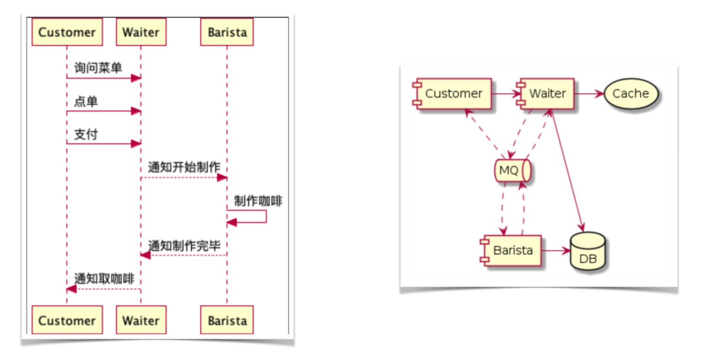

# spring-cloud-springbucks

使用Spring Cloud实现咖啡厅点单系统，梳理极客时间《玩转Spring全家桶》。

## 运行
分别在 `barista-service`，`customer-service`，`waiter-service` 项目打包
```bash
mvn clean package -Dmaven.test.skip=true
```
在 `spring-cloud-springbucks` 项目下使用 docker-compose 运行，会同时启动9个容器，对机器配置有点高
```bash
docker-compose up -d   # 启动（可能会很慢）
docker-compose ps      # 查看进程
docker-compose logs    # 查看logs
docker-compose down    # 停止并删除容器
docker-compose help    # 查看跟多命令
```
## 查看监控

- [Zipkin](http://localhost:9411/zipkin)
- [Consul](http://localhost:8500)
- [Actuator](http://localhost:8080/actuator)

## 开发环境
- MacOS
- JDK8
- Docker

## 开发工具
- Git: 版本管
- IntelliJ IDEA: 开发IDE
- Postman: 测试接口
- Maven: 构建管理

## 技术栈

技术 | 名称 | 官网
----|------|----
Spring Cloud | 微服务框架  | [https://spring.io/projects/spring-cloud](https://spring.io/projects/spring-cloud)
Redis | 分布式缓存数据库  | [https://redis.io](https://redis.io)
Mysql | 关系型数据库 | [https://www.mysql.com](https://www.mysql.com)
Rabbitmq | MQ | [https://www.rabbitmq.com](https://www.rabbitmq.com)
Consul | 服务发现/注册/配置中心 | [https://www.consul.io](https://www.consul.io)
OpenFeign | 服务负载/调用 | [https://cloud.spring.io/spring-cloud-openfeign/single/spring-cloud-openfeign.html](https://cloud.spring.io/spring-cloud-openfeign/single/spring-cloud-openfeign.html)
Resilience4j | 服务熔断/限流 | [https://github.com/resilience4j/resilience4j](https://github.com/resilience4j/resilience4j)
Zipkin | 服务链路追踪 | [https://zipkin.io](https://zipkin.io)
Log4J | 日志组件  | [http://logging.apache.org/log4j/1.2/](http://logging.apache.org/log4j/1.2/)
Docker | 容器 | [https://www.docker.com](https://www.docker.com)
Maven | 项目构建管理  | [http://maven.apache.org](http://maven.apache.org)

## 项目流程
